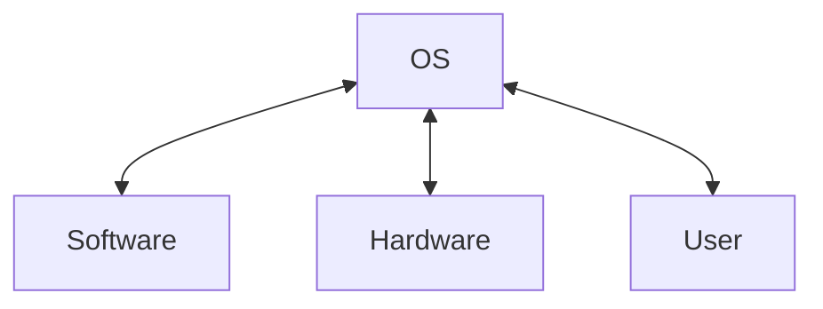
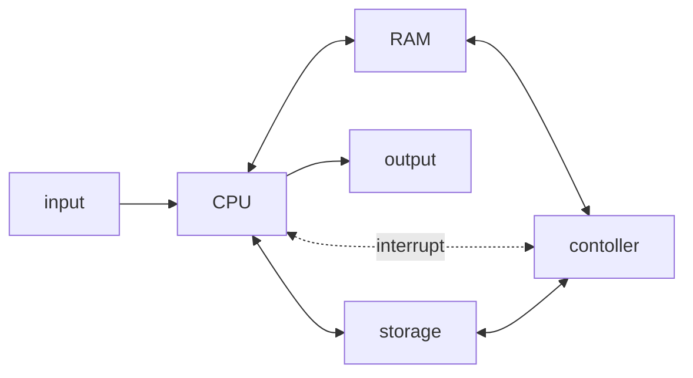

# Лекция №1. Эволюция ОС.

**Операционная система** - это базовое системное программное обеспечение, управляющее работой вычислительного узла и являющееся посредником между аппаратным обеспечением, прикладным программным обеспечением и пользователем.

Принципы архитектуры фон Неймана:

1. **Однородность памяти.** И код, и данные находятся в единой памяти.
2. **Принцип адресноти.** Есть линейная система адресов в оперативной памяти, а так же в любой момент времени процессор может получить доступ к любой ячейке в памяти.
3. **Принцип программного управления.** После выполнения команды в ячейке происходит переход на следующую ячейку, и команда в ней выполняется и т.д.
4. **Принцип кодирования.** Для всего используется двоичное кодирование.

## Программы-диспетчеры

Основные задачи на этом этапе:

1. **Повторное использование кода, автоматизация загрузки и линковки.** Часто возникала проблема, когда при изменении какой-то части программы, приходилось переписывать те части, которые не изменялись. 
2. **Оптимизация взаимодействия с устройствами хранения, ввода и вывода.** Не всегда для обрабатываемого файла хватало места в оперативной памяти. 
3. **Появление однопрограммной пакетной обработки.** Начало появляться много разных пакетов от разных разработчиков, которые подавались как отдельные программы.

Решения:

1. Выделить блок памяти под такие куски, кода, которые не меняются, по факту место для библиотек.
2. Появляется новое аппаратное решение - контроллер. Это вычислительный узел, который связывает хранилище и оперативную память и осуществляет подкачку данных из хранилища в оперативную память. Это решение получило название **spooling**. Но, чтобы ЦП знал о том, что контроллер закончил работу над пулом, была добавлена связь контроллера и ЦП через **прерывания**.
3. Одновременно можно выполнять только один пакет, поэтому решение аналогично решению второй задачи. Сначала выполняется первая программа, потом контроллером вторая и тоже выполняется. Появились очереди доступа к ресурсу - процессорному времени. 

**Прерывание** - это сигнал, поступающий от внешнего устройства к ЦП, сообщающий о наступлении некоторого события, в результате которого процессор приостанавливает выполнение текущего набора команд и передает управление подпрограмме - обработчику прерываний.

# Мультипрограммные ОС

Появилась проблема, бывают разные программы, которые, например сильно нагружают процессор, но при этом контроллер делает мало, или наоборот. В таких случаях какой-то из вычислительных узлов будет простаивать, хотя в этом время он мог что-то делать.

_Решение:_ Пусть простаивающий узел продолжает работать, например, если задача не сильно нагружает контроллер, но при этом ЦП работает, можно продолжать работу контроллера для следующей задачи, а когда ЦП закончит работу с предыдущей ему не придется ждать загрузки контроллера.

Но для такого распределения задач между вычислительными узлами не хватит программ-диспетчеров, поэтому появляется понятие **операционной системы**.
