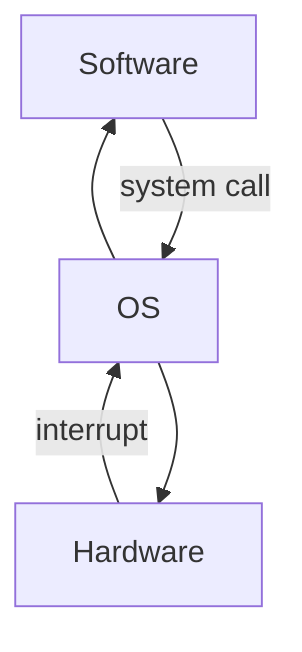
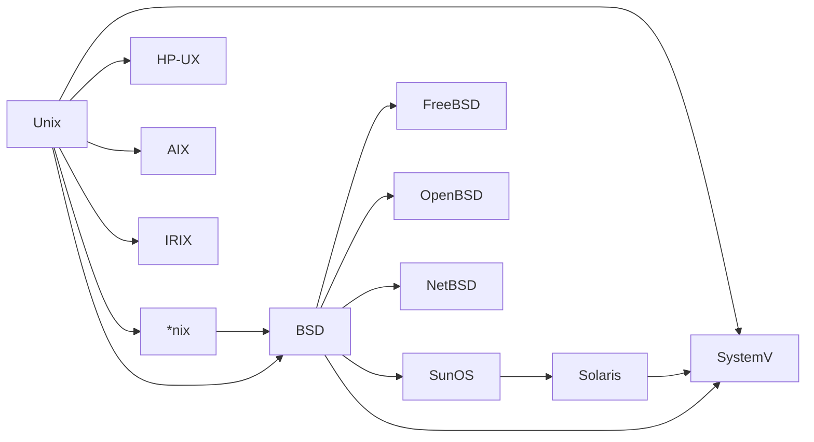

# Лекция №2. Эволюция ОС.

## Мультипрограмные ОС

Основные задачи на этом этапе:

1. **Обеспечение разделения процессорного времени.**  
2. **Обеспечение разделения памяти.**
3. **Обеспечение защиты программ от деятельности других программ.**
4. **Планирование исполнения и синхронизации программ.**
5. **Обеспечение универсального доступа к устройствам хранения.**

Решения:

1. Добавили аппаратный таймер, который будет посылает прерывание ЦП по истечению какого-то времени. Так же нужен механизм, который будет обеспечиавть сохранение контекста регистров ЦП при смене процесса и возвращать регистры в нужное состояние при возвращении на процесс.
2. Появился механизм виртуальной памяти. Суть в том, что для программ, которые мы загружаем в оперативную память адреса начинаются с нуля, но это виртуальный ноль. При запуске программы происходит пересчет адресов с виртуальных на реальные, чтобы программа работала корректно. Это позволяет при написании программы не задумываться о том, какие адреса у программы будут в оперативной памяти.
3. Было добавлено решение на аппартном уровне, которое посылает прерывание процессору, если программа пользуется чужой памятью.
4. хз
5. Появилась файлово-католожная система.

Совместное решение всех этих задач привело к необходимости объединить весь функционал в рамках единого системного базового программного обеспечения, которое и назвали операционной системой.

Появилась концепция **виртуальной машины**. Отдельные приложения запускаются на виртуальных изолированных вычислительных узлах, они ничего не знают про другие приложения, ресурсы. Операционная система абстрагирует программное и аппаратное обеспечение друг от друга, является посредником.

Аппаратное обеспечение посылает ОС прерывания, а программное обеспечение системные вызовы.

**Системный вызов** - это обращение пользовательского программного обеспечения к ядру операционной системы с просьбой выполнить некую привелегированную операцию или предоставить некоторый аппаратный ресурс.

**MCP** - первая ОС (1963 г.)

## Сетевые ОС

Появилась проблема с вводом и выводом, хотелось бы получать доступ к взаимодействию с компьютером удаленно, потому что на тот момент даже не в каждом населенном пункте были компьютеры и приходилось тратить много времени и денег, чтобы получить доступ к вычислительным мощностям. 

_Решением стали удаленные (телефонная связь) терминалы, которые совмещали в себе и ввод и вывод, а также появилось понятие многотерминальности - это, когда доступ к взаимодействию к компьтеру осуществляется с разных терминалов._

Появилась новая проблема, неизвестно, кто находится за удаленным терминалом, а контролировать действия с каждого терминала дорого, поэтому появляются понятия идентификации, аутентификации и авторизации

Также проблемой стало то, что на какой-то узел (точнее на терминал, связанный с этим узлом) идет наплыв людей, поэтому он постоянно работает, в то же время где-то, терминал не особо пользуется популярностью и вычислительный узел часто простаивает. 

_Решить это можно объединением нескольких вычислительных узлов в единую сеть так, чтобы загруженные узлы могли перебрасывать свои задачи на простаивающие._

## Универсальные (мобильные) ОС

Образовалась следующая проблема, для каждого компьютера разрабатывается своя ОС, поэтому приложения постоянно приходится переписывать для каждой ОС, что сильно тормозит развитие.

_Решением будет создание ОС, которая поддерживает разработку приложений на языке высокого уровня, то есть, чтобы ОС преобразовала системные вызовы приложений в язык понятный железу. В таком случае и ОС должна быть на языке высокого уровня._

В 1969 году были созданы язык C и ОС UNICS.

Первая версия UNICS была запущена 01.01.1970. Она была написана на ассемблере и не имела компилятора языка высокого уровня. 

Далее был разработан интерпретируемый язык B и UNICS переписывается на нем, в 1972 году выпущена вторая редакция UNICS.

Параллельно разрабатывался компилируемый язык C и код, написанный на B постепенно переписывается на C.

В 1973 появляется третья редакция UNICS с встроенным компилятором C, и уже в 1974 появляется четвертая реакция, в которой ядро написано на C. В 1975 выходит пятая редакция, в которой не только ядро, но и все утилиты написаны на C.

Последняя редакция Unix появляется в 1978. 

Далее уже развивались наследники Unix, обозначаемые *nix.

В 1983 году в MIT появляется проект GNU. Идея заключается в том, чтобы создавать свободное ПО, для этого нужна свободная ОС, поэтому ее придется сделать с нуля.

Четыре основы свободны создателя GNU:

1. Свобода использовать ПО
2. Свобода изучать и адаптировать ПО
3. Свобода распространять ПО
4. Свобода улучшать и публиковать ПО

Появляется идея copyleft: если есть какое-то ПО под лицензией copyleft, то и все то, где используется это ПО должно быть открытым. Таким образом, все то, что связано с открытым программным обеспечением, тоже будет открыто.

GNU расшифровывается как Gnu is Not Unix. 

В рамках GNU пишется компилятор для языка C - gcc.

В 1991 году еще студент Линус Торвальдс публикует ОС Linux, которая основана на ОС Minix. Многие ее использует, но создатель Minix Эндрю Таненбаум жестко критикует ее, говоря, что Linux устарел, но Торвальдс не сдается. Он продолжает работать над Linux и часто использует наработки GNU, и так появилась ОС GNU/Linux.

